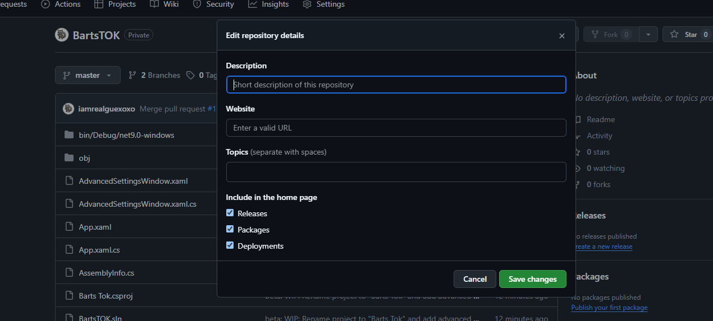

# 🎉 BartsTOK - Der ultimative Inaktivitäts-Verhinderer! 🎉


[](https://dotnet.microsoft.com/)
[](https://docs.microsoft.com/en-us/dotnet/desktop/wpf/)
[](LICENSE)

## 📝 Kurze Beschreibung / Short Description

**Deutsch:** BartsTOK ist eine WPF-App für Windows, die deinen PC wach hält, die Maus bewegt und Bildschirm-Brand verhindert. Mit tanzenden Barts-GIFs und vielen Features!

**English:** BartsTOK is a WPF app for Windows that keeps your PC awake, moves the mouse, and prevents screen burn. Featuring dancing Bart GIFs and tons of features!

Willkommen bei **BartsTOK**! 🚀 Diese coole WPF-Anwendung für Windows (.NET 9) hält deinen Computer wach, bewegt die Maus und verhindert Bildschirm-Brand. Inspiriert von den genialen Projekten "movemouse" und "burnstok" von sgrottl. Vielen Dank an sgrottl für die Inspiration! 🙏

## ✨ Features - Was kann BartsTOK?

### 🖱️ Maus-Bewegung (Move Mouse)
- **Kreisförmige oder zufällige Bewegung**: Lass die Maus im Kreis drehen oder zufällig herumwandern.
- **Smooth & Interpolation**: Natürliche, flüssige Bewegungen – kein roboterhaftes Zucken!
- **Klicks während der Bewegung**: Linksklick, Rechtsklick oder Doppelklick – konfigurierbare Intervalle.
- **Follow-Modi**: Folge der Maus oder einem bestimmten Fenster.
- **Presets**: Speichere und lade deine Lieblings-Einstellungen (Radius, Speed, etc.).
- **Hotkeys**: Starte/Stoppe mit einem Tastendruck.

### ⏰ Planer & Scheduler
- **Zeitgesteuerte Aktionen**: Starte oder Stoppe automatisch zu bestimmten Zeiten.
- **Tägliche oder wöchentliche Pläne**: Everyday oder spezifische Wochentage.
- **Mehrere Einträge**: Erstelle so viele Schedules wie du willst.

### ⚙️ Erweiterte Einstellungen
- **Auto-Start**: Starte automatisch beim Systemstart.
- **Tray-Icon**: Verstecke im System-Tray mit Kontextmenü.
- **Bildschirm-Schutz**: Verhindere Screen-Burn mit Timer-basierten Bewegungen.
- **System-Events**: Reagiere auf Lock/Unlock und Batterie-Status.
- **Volume-Anpassung**: Passe die Lautstärke an, wenn die App läuft.
- **Logging**: Optionale Datei-Logs für Debugging.

### 🎨 UI & UX
- **Schöne WPF-Oberfläche**: Moderne, benutzerfreundliche Fenster.
- **GIF-Animationen**: Tanzende Barts für Loading und Header! 💃🕺
- **Minimieren & Verstecken**: Optionen zum Verstecken in Tray, Taskbar, etc.
- **Hotkeys**: F1/F2 für schnellen Start/Stop.

## 📸 Screenshots & GIFs

Hier ein paar coole GIFs und Screenshots von BartsTOK in Aktion:

### Tanzender Bart beim Laden:


### Screenshot der App:



## 🚀 Installation & Setup

1. **Voraussetzungen**:
   - Windows 10/11
   - .NET 9 SDK (kostenlos von [Microsoft](https://dotnet.microsoft.com/download))

2. **Klonen & Bauen**:
   ```powershell
   git clone https://github.com/iamrealguexoxo/BartsTOK.git
   cd BartsTOK
   dotnet build
   ```

3. **Ausführen**:
   ```powershell
   dotnet run
   ```
   Oder öffne `BartsTOK.sln` in Visual Studio und drücke F5.

## 📖 Verwendung / Usage

### Schnellstart:
1. Starte die App.
2. Drücke **Start** (oder F1) im Hauptfenster.
3. Öffne **Move Mouse** für Maus-Bewegungen.
4. Gehe zu **Erweiterte Einstellungen** für mehr Optionen.

### Tipps:
- **Vorsichtig mit Klicks**: Die App klickt wirklich – teste in einer sicheren Umgebung!
- **Presets speichern**: Erstelle Presets für verschiedene Szenarien (z.B. "Office" vs. "Gaming").
- **Scheduler**: Plane Pausen oder Aktivitäten für den ganzen Tag.

## 🛠️ Entwicklung / Development

### Projekt-Struktur:
- `MainWindow.xaml/cs`: Hauptfenster & Core-Logik.
- `MoveMouseWindow.xaml/cs`: Maus-Bewegungs-Fenster.
- `AdvancedSettingsWindow.xaml/cs`: Einstellungen-Dialog.
- `SettingsManager.cs`: Persistenz für Einstellungen.

### Beitragen:
1. Fork das Repo.
2. Erstelle einen Branch: `git checkout -b feature/awesome-feature`
3. Committe deine Änderungen: `git commit -m 'Add awesome feature'`
4. Push und erstelle einen Pull Request.

### Bekannte Einschränkungen:
- Scheduler prüft alle 30 Sekunden – nicht für Mikrosekunden-Genauigkeit.
- Einige Features haben Fallbacks für robuste Fehlerbehandlung.

## 📜 Lizenz / License

Dieses Projekt ist unter der MIT-Lizenz lizenziert. Siehe [LICENSE](LICENSE) für Details.

## 🙏 Danksagung / Acknowledgments

Ein großes Dankeschön an:
- **sgrottl** für die Inspiration durch "movemouse" und "burnstok".
- Die .NET-Community für tolle Tools und Dokumentation.

---

**Viel Spaß mit BartsTOK!** 🎊 Wenn du Fragen hast, öffne ein Issue oder kontaktiere mich. 😊
